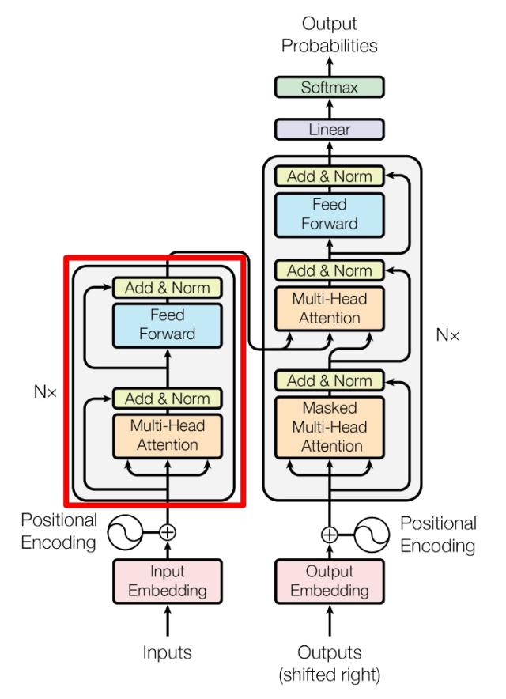
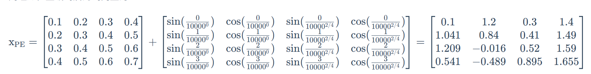

#LLMBasic
## FNN

```python
class MLP(nn.Module):
    '''前馈神经网络'''
    def __init__(self, dim: int, hidden_dim: int, dropout: float):
        super().__init__()
        # 定义第一层线性变换，从输入维度到隐藏维度
        self.w1 = nn.Linear(dim, hidden_dim, bias=False)
        # 定义第二层线性变换，从隐藏维度到输入维度
        self.w2 = nn.Linear(hidden_dim, dim, bias=False)
        # 定义dropout层，用于防止过拟合
        self.dropout = nn.Dropout(dropout)

    def forward(self, x):
        # 前向传播函数
        # 首先，输入x通过第一层线性变换和RELU激活函数
        # 最后，通过第二层线性变换和dropout层
        return self.dropout(self.w2(F.relu(self.w1(x))))
    
```

## Layer Norm

Layer Norm（层归一化）是深度学习中一种重要的归一化技术，旨在通过标准化输入数据的分布来加速模型训练、提升稳定性。它与 Batch Norm、Instance Norm 等归一化方法的核心区别在于**归一化的维度**，这使得它在处理序列数据（如文本）或小批量场景时表现更优。

### **一、Layer Norm 的核心思想**
在深度学习中，随着网络层数加深，每一层的输入分布会因前层参数更新而不断变化（即“内部协变量偏移”），导致训练困难（如收敛慢、梯度不稳定）。归一化技术通过将输入数据标准化到均值为 0、方差为 1 的分布，缓解这一问题。

Layer Norm 的核心是：**在“特征维度”上对单个样本的所有特征进行归一化**，与样本所在的批次（batch）无关。


### **二、Layer Norm 的计算步骤**
假设输入张量为 $x \in \mathbb{R}^{N \times D}$，其中 $N$ 是样本数（batch size），$D$ 是每个样本的特征维度（如词向量维度、图像通道数等）。Layer Norm 的计算过程如下：


1. **计算特征维度的均值**  
   对每个样本的所有特征计算均值：  
   $$
   \mu_i = \frac{1}{D} \sum_{j=1}^{D} x_{i, j}
   $$  
   其中 $x_{i, j}$ 是第 $i$ 个样本的第 $j$ 个特征，$\mu_i$ 是第 $i$ 个样本的特征均值。


2. **计算特征维度的方差**  
   对每个样本的所有特征计算方差（加 $\epsilon$ 避免分母为 0）：  
   $$
   \sigma_i^2 = \frac{1}{D} \sum_{j=1}^{D} (x_{i, j} - \mu_i)^2 + \epsilon
   $$  
   其中 $\epsilon$ 是一个极小值（通常取 $10^{-5}$）。


3. **标准化（归一化）**  
   将每个特征减去均值、除以标准差，得到标准化后的特征：  
   $$
   \hat{x}_{i, j} = \frac{x_{i, j} - \mu_i}{\sqrt{\sigma_i^2}}
   $$  


4. **缩放与偏移（可学习参数）**  
   为了保留数据的表达能力，引入可学习参数 $\gamma$（缩放）和 $\beta$（偏移），对标准化结果进行调整：  
   $$
   Y_{i, j} = \gamma \cdot \hat{x}_{i, j} + \beta
   $$  
   其中 $y_{i, j}$ 是 Layer Norm 的输出。

### **三、与其他归一化方法的对比**
不同归一化方法的核心差异在于**归一化的维度**，以下是常见对比：

| 方法         | 归一化维度                          | 适用场景                     | 缺点                          |
|--------------|-------------------------------------|------------------------------|-------------------------------|
| Batch Norm   | 批次维度（对整个 batch 的同一特征）   | 计算机视觉（图像）、大 batch  | 依赖 batch size，小 batch 效果差 |
| Layer Norm   | 特征维度（对单个样本的所有特征）    | NLP（文本）、小 batch、RNN    | 对特征维度分布敏感            |
| Instance Norm | 单个样本的通道内（如单张图像的通道） | 风格迁移、图像生成           | 忽略样本间关联                |
| Group Norm   | 将特征分组，组内归一化              | 小 batch 场景（如医学影像）    | 分组方式需人工设计            |


### **四、Layer Norm 的优点**


1. **不依赖 batch size**  
   归一化仅基于单个样本的特征，不受批次大小影响，适合小批量训练（如 NLP 中 batch size 较小时）或在线学习。

2. **适合序列数据**  
   在循环神经网络（RNN）或 Transformer 等处理序列的模型中，序列长度可能动态变化（如文本 padding），Layer Norm 可稳定处理每个时间步的特征。

3. **训练与推理一致**  
   Batch Norm 在推理时需使用训练阶段的移动均值/方差，而 Layer Norm 在训练和推理时计算逻辑完全一致，无需额外存储参数。

4. **缓解梯度问题**  
   标准化后的输入分布更稳定，有助于缓解梯度消失/爆炸，加速模型收敛。


### **五、典型应用场景**

1. **自然语言处理（NLP）**  
   - Transformer 模型（如 BERT、GPT）的核心组件“Add & Norm”中，Layer Norm 是标配。例如，每个多头注意力层或前馈网络层后，都会通过 Layer Norm+残差连接稳定训练。  
   - 原因：文本样本的特征分布差异大（如不同句子的语义差异），Batch Norm 在小 batch 下效果差，而 Layer Norm 更鲁棒。

2. **循环神经网络（RNN/LSTM/GRU）**  
   序列数据的每个时间步输入分布可能波动，Layer Norm 可在每个时间步独立归一化，提升模型稳定性。

3. **小批量或动态 batch 场景**  
   如医学影像（样本量少）、在线推理（实时生成 batch）等，Layer Norm 可避免 Batch Norm 的性能下降。

### **六、注意事项**

- **特征维度需足够大**：若特征维度 $D$ 过小（如小于 10），均值和方差的估计可能不稳定，影响归一化效果。  
- **可学习参数的作用**：$\gamma$ 和 $\beta$ 允许模型“还原”部分原始分布，避免过度归一化导致的信息丢失。  
- **与残差连接配合**：在 Transformer 等模型中，Layer Norm 常与残差连接（$x + \text{SubLayer}(x)$）结合，进一步增强训练稳定性。

### **七、代码实现**

```python
class LayerNorm(nn.Module):
    ''' Layer Norm 层'''
    def __init__(self, features, eps=1e-6):
    super().__init__()
    # 线性矩阵做映射
    self.a_2 = nn.Parameter(torch.ones(features))
    self.b_2 = nn.Parameter(torch.zeros(features))
    self.eps = eps
    
    def forward(self, x):
    # 在统计每个样本所有维度的值，求均值和方差
    mean = x.mean(-1, keepdim=True) # mean: [bsz, max_len, 1]
    std = x.std(-1, keepdim=True) # std: [bsz, max_len, 1]
    # 注意这里也在最后一个维度发生了广播
    return self.a_2 * (x - mean) / (std + self.eps) + self.b_2
```

## 残差

由于 Transformer 模型结构较复杂、层数较深，​为了避免模型退化，Transformer 采用了残差连接的思想来连接每一个子层。残差连接，即下一层的输入不仅是上一层的输出，还包括上一层的输入。残差连接允许最底层信息直接传到最高层，让高层专注于残差的学习。

```python
# 注意力计算
h = x + self.attention.forward(self.attention_norm(x))
# 经过前馈神经网络
out = h + self.feed_forward.forward(self.fnn_norm(h))
```

## Encoder



```python
class EncoderLayer(nn.Module):
  '''Encoder层'''
    def __init__(self, args):
        super().__init__()
        # 一个 Layer 中有两个 LayerNorm，分别在 Attention 之前和 MLP 之前
        self.attention_norm = LayerNorm(args.n_embd)
        # Encoder 不需要掩码，传入 is_causal=False
        self.attention = MultiHeadAttention(args, is_causal=False)
        self.fnn_norm = LayerNorm(args.n_embd)
        self.feed_forward = MLP(args.dim, args.dim, args.dropout)

    def forward(self, x):
        # Layer Norm
        norm_x = self.attention_norm(x)
        # 自注意力
        h = x + self.attention.forward(norm_x, norm_x, norm_x)
        # 经过前馈神经网络
        out = h + self.feed_forward.forward(self.fnn_norm(h))
        return out
```

```python
class Encoder(nn.Module):
    '''Encoder 块'''
    def __init__(self, args):
        super(Encoder, self).__init__() 
        # 一个 Encoder 由 N 个 Encoder Layer 组成
        self.layers = nn.ModuleList([EncoderLayer(args) for _ in range(args.n_layer)])
        self.norm = LayerNorm(args.n_embd)

    def forward(self, x):
        "分别通过 N 层 Encoder Layer"
        for layer in self.layers:
            x = layer(x)
        return self.norm(x)
```

## Decoder

```python
class DecoderLayer(nn.Module):
  '''解码层'''
    def __init__(self, args):
        super().__init__()
        # 一个 Layer 中有三个 LayerNorm，分别在 Mask Attention 之前、Self Attention 之前和 MLP 之前
        self.attention_norm_1 = LayerNorm(args.n_embd)
        # Decoder 的第一个部分是 Mask Attention，传入 is_causal=True
        self.mask_attention = MultiHeadAttention(args, is_causal=True)
        self.attention_norm_2 = LayerNorm(args.n_embd)
        # Decoder 的第二个部分是 类似于 Encoder 的 Attention，传入 is_causal=False
        self.attention = MultiHeadAttention(args, is_causal=False)
        self.ffn_norm = LayerNorm(args.n_embd)
        # 第三个部分是 MLP
        self.feed_forward = MLP(args.dim, args.dim, args.dropout)

    def forward(self, x, enc_out):
        # Layer Norm
        norm_x = self.attention_norm_1(x)
        # 掩码自注意力
        x = x + self.mask_attention.forward(norm_x, norm_x, norm_x)
        # 多头注意力，q，k使用encoder的输出
        norm_x = self.attention_norm_2(x)
        h = x + self.attention.forward(norm_x, enc_out, enc_out)
        # 经过前馈神经网络
        out = h + self.feed_forward.forward(self.ffn_norm(h))
        return out
```

```python
class Decoder(nn.Module):
    '''解码器'''
    def __init__(self, args):
        super(Decoder, self).__init__() 
        # 一个 Decoder 由 N 个 Decoder Layer 组成
        self.layers = nn.ModuleList([DecoderLayer(args) for _ in range(args.n_layer)])
        self.norm = LayerNorm(args.n_embd)

    def forward(self, x, enc_out):
        "Pass the input (and mask) through each layer in turn."
        for layer in self.layers:
            x = layer(x, enc_out)
        return self.norm(x)
```

## Embedding

在 NLP 任务中，我们往往需要将自然语言的输入转化为机器可以处理的向量。在深度学习中，承担这个任务的组件就是 Embedding 层

上述实现并不复杂，我们可以直接使用 torch 中的 Embedding 层：

```python
self.tok_embeddings = nn.Embedding(args.vocab_size, args.dim)
```

## 位置编码

在注意力机制的计算过程中，对于序列中的每一个 token，其他各个位置对其来说都是平等的，即“我喜欢你”和“你喜欢我”在注意力机制看来是完全相同的，但无疑这是注意力机制存在的一个巨大问题。因此，为使用序列顺序信息，保留序列中的相对位置信息，Transformer 采用了位置编码机制，该机制也在之后被多种模型沿用

​位置编码，即根据序列中 token 的相对位置对其进行编码，再将位置编码加入词向量编码中。位置编码的方式有很多，Transformer 使用了正余弦函数来进行位置编码（绝对位置编码Sinusoidal），其编码方式为：$$ \begin{align*} PE(pos, 2i) &= \sin\left(\frac{pos}{10000^{2i/d_{\text{model}}}}\right) \\ PE(pos, 2i + 1) &= \cos\left(\frac{pos}{10000^{2i/d_{\text{model}}}}\right) \end{align*} $$
​上式中，pos 为 token 在句子中的位置，2i 和 2i+1 则是指示了 token 是奇数位置还是偶数位置，从上式中我们可以看出对于奇数位置的 token 和偶数位置的 token，Transformer 采用了不同的函数进行编码

实例：



实现：获得矩阵的位置编码

```python
class PositionalEncoding(nn.Module):
    '''位置编码模块'''

    def __init__(self, args):
        super(PositionalEncoding, self).__init__()
        # Dropout 层
        # self.dropout = nn.Dropout(p=args.dropout)

        # block size 是序列的最大长度
        pe = torch.zeros(args.block_size, args.n_embd)
        position = torch.arange(0, args.block_size).unsqueeze(1)
        # 计算 theta
        div_term = torch.exp(
            torch.arange(0, args.n_embd, 2) * -(math.log(10000.0) / args.n_embd)
        )
        # 分别计算 sin、cos 结果
        pe[:, 0::2] = torch.sin(position * div_term)
        pe[:, 1::2] = torch.cos(position * div_term)
        pe = pe.unsqueeze(0)
        self.register_buffer("pe", pe)

    def forward(self, x):
        # 将位置编码加到 Embedding 结果上
        x = x + self.pe[:, : x.size(1)].requires_grad_(False)
        return x
```